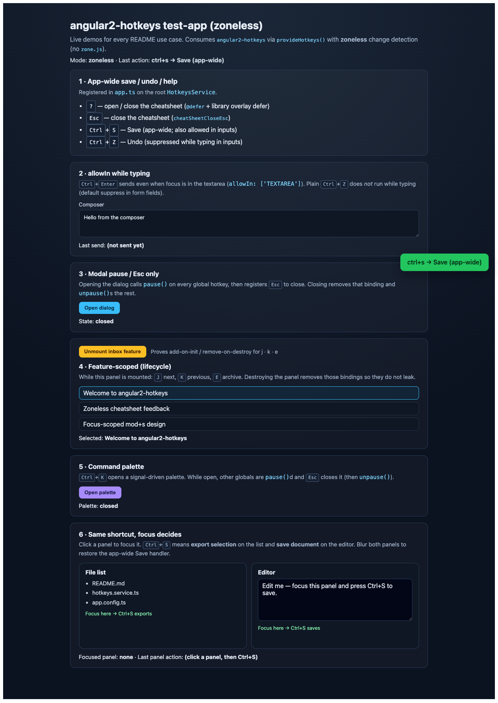
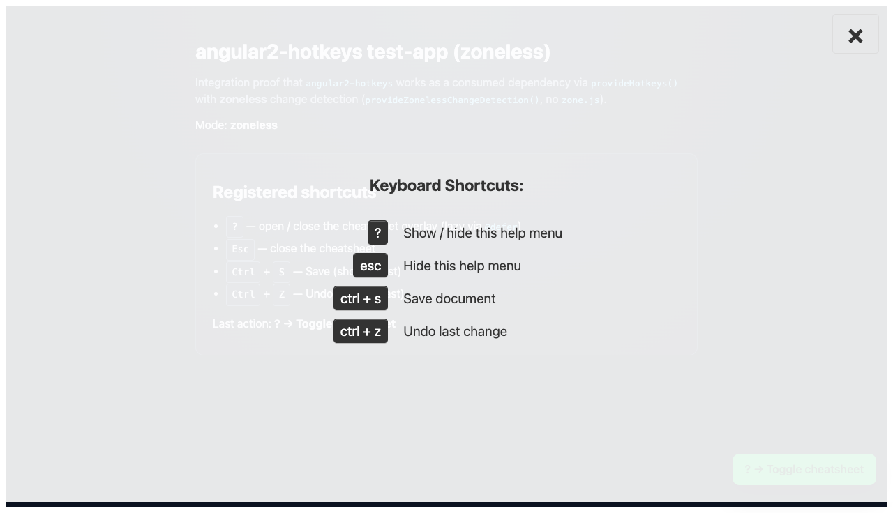

# angular2-hotkeys

<p align="center">
  <strong>Declarative keyboard shortcuts for Angular</strong><br />
  Standalone APIs · Signals · Mousetrap · Nx workspace
</p>

<p align="center">
  <a href="https://www.npmjs.com/package/angular2-hotkeys"></a>
  <a href="https://angular.dev/"></a>
  <a href="https://nx.dev/"></a>
  <a href="https://www.typescriptlang.org/"></a>
  <a href="./LICENSE"></a>
  <a href="https://nodejs.org/"></a>
</p>

---

**angular2-hotkeys** lets you bind global and element-scoped keyboard shortcuts in Angular apps, with an optional on-screen cheat sheet. It is powered by [Mousetrap](https://craig.is/killing/mice) and ships as a modern **standalone / Signals** library managed with **[Nx](https://nx.dev)**.

| | |
| :--- | :--- |
| **Package** | [`angular2-hotkeys@22.0.0`](https://www.npmjs.com/package/angular2-hotkeys) |
| **Peers** | `@angular/core` · `@angular/common` `^22` · `rxjs` `^7` |
| **Runtime** | Node `^22.22.3 \|\| ^24.15.0 \|\| >=26` · see [`.nvmrc`](.nvmrc) |
| **Demo** | [`test-app/`](./test-app) · `npx nx serve test-app` → `http://127.0.0.1:4300/` |
| **Dashboard** | [`ui/`](./ui) · `make ui` → `http://localhost:8765/` |

<p align="center">
  
  <br />
  <sub>Integration demo — cheat sheet toggle (<code>?</code>), close (<code>Esc</code>), and app shortcuts</sub>
</p>

---

## Table of contents

1. [Why this library](#why-this-library)
2. [Requirements](#requirements)
3. [Installation](#installation)
4. [Quick start](#quick-start)
5. [Cheat sheet](#cheat-sheet)
6. [Configuration](#configuration)
7. [API reference](#api-reference)
8. [Compatibility](#compatibility)
9. [Legacy NgModule support](#legacy-ngmodule-support-deprecated)
10. [Development (Nx workspace)](#development-nx-workspace)
11. [Scripts & Makefile](#scripts--makefile)
12. [License & credits](#license--credits)

---

## Why this library

| Feature | Detail |
| :--- | :--- |
| **Angular 22 native** | `provideHotkeys()`, standalone components/directives, signal-based state |
| **Global + local bindings** | App-wide service API and optional element-scoped `HotkeysDirective` |
| **Built-in help UI** | `<hotkeys-cheatsheet>` overlay, toggle with `?` (configurable) |
| **Mousetrap combos** | Familiar syntax: `ctrl+s`, `meta+shift+g`, sequences, mod keys |
| **Tree-shakeable package** | `sideEffects: false`, Ivy partial compilation via ng-packagr |
| **Nx monorepo** | Library + real consumer app in one graph (`build` / `test` / `lint` / `serve`) |

---

## Requirements

| Tool | Version |
| :--- | :--- |
| **Angular** | `^22.0.0` |
| **RxJS** | `^7.0.0` |
| **Node.js** | `^22.22.3` or `^24.15.0` or `>=26` |
| **TypeScript** (apps) | `~6.0` recommended |

> Older library lines target older Angular majors — see [Compatibility](#compatibility).

---

## Installation

```bash
npm install angular2-hotkeys
```

Ensure peers are present (most Angular apps already have them):

```bash
npm install @angular/core@^22 @angular/common@^22 rxjs@^7
```

---

## Quick start

### 1. Register providers

```ts
// app.config.ts
import { ApplicationConfig, provideZoneChangeDetection } from '@angular/core';
import { provideHotkeys } from 'angular2-hotkeys';

export const appConfig: ApplicationConfig = {
  providers: [
    provideZoneChangeDetection({ eventCoalescing: true }),
    provideHotkeys({
      cheatSheetCloseEsc: true,
      cheatSheetDescription: 'Show / hide this help menu',
    }),
  ],
};
```

### 2. Bind shortcuts & show the cheat sheet

```ts
// app.component.ts
import { Component, OnInit } from '@angular/core';
import {
  Hotkey,
  HotkeysCheatsheetComponent,
  HotkeysService,
  type ExtendedKeyboardEvent,
} from 'angular2-hotkeys';

@Component({
  selector: 'app-root',
  standalone: true,
  imports: [HotkeysCheatsheetComponent],
  template: `
    <main>
      <h1>My app</h1>
      <!-- Optional custom title (signal input) -->
      <hotkeys-cheatsheet title="Keyboard Shortcuts:" />
    </main>
  `,
})
export class AppComponent implements OnInit {
  constructor(private readonly hotkeys: HotkeysService) {}

  ngOnInit(): void {
    this.hotkeys.add(
      new Hotkey(
        'meta+shift+g',
        () => {
          console.log('Typed hotkey');
          return false; // prevent default / stop bubbling for Mousetrap
        },
        undefined, // allowIn: e.g. ['INPUT', 'TEXTAREA']
        'Send a secret message to the console.',
      ),
    );

    // One handler, multiple combos
    this.hotkeys.add(
      new Hotkey(
        ['meta+shift+g', 'alt+shift+s'],
        (event: KeyboardEvent, combo: string) => {
          console.log('Combo:', combo);
          const e = event as ExtendedKeyboardEvent;
          e.returnValue = false;
          return e;
        },
      ),
    );
  }
}
```

### Callback contract

| Return value | Meaning |
| :--- | :--- |
| `false` | Prevent default behavior / stop propagation (Mousetrap convention) |
| `true` | Allow the event to continue |
| `ExtendedKeyboardEvent` | Mutate and return the event (e.g. set `returnValue`) |

Supported key strings follow Mousetrap: [craig.is/killing/mice](https://craig.is/killing/mice).

---

## Cheat sheet

Add the standalone component once near the root of your UI:

```html
<hotkeys-cheatsheet />
<!-- or -->
<hotkeys-cheatsheet title="Hotkeys Rock!" />
```

| Behavior | Default |
| :--- | :--- |
| Toggle combo | `?` (configurable) |
| Close with `Esc` | off — set `cheatSheetCloseEsc: true` |
| Default title | `Keyboard Shortcuts:` |
| Rows shown | Only hotkeys that have a **description** |

**Tips**

- Pass a `string` or `() => string` as the 4th `Hotkey` argument for the help text.
- Pass `allowIn` as the 3rd argument (`['INPUT', 'SELECT', 'TEXTAREA']`) if the combo should fire while typing in form fields.
- Visibility is driven by `HotkeysService.cheatSheetToggle` (a `WritableSignal<boolean>`).

<p align="center">
  
</p>

---

## Configuration

Pass an `IHotkeyOptions` object to `provideHotkeys(options)`:

```ts
provideHotkeys({
  disableCheatSheet: false,
  cheatSheetHotkey: '?',
  cheatSheetCloseEsc: true,
  cheatSheetCloseEscDescription: 'Hide this help menu',
  cheatSheetDescription: 'Show / hide this help menu',
});
```

| Option | Type | Default | Description |
| :--- | :--- | :--- | :--- |
| `disableCheatSheet` | `boolean` | `false` | Skip registering the help overlay toggle |
| `cheatSheetHotkey` | `string` | `'?'` | Combo that toggles the cheat sheet |
| `cheatSheetCloseEsc` | `boolean` | `false` | Also bind `Esc` to close the sheet |
| `cheatSheetCloseEscDescription` | `string` | `'Hide this help menu'` | Help text for the Esc row |
| `cheatSheetDescription` | `string` | `'Show / hide this help menu'` | Help text for the toggle combo |

---

## API reference

All public symbols are re-exported from `angular2-hotkeys`:

| Export | Kind | Purpose |
| :--- | :--- | :--- |
| `provideHotkeys()` | function | Environment providers for standalone bootstrap |
| `HotkeysService` | service | `add` / `remove` / `get` / `pause` / `unpause`; `cheatSheetToggle` signal |
| `Hotkey` | class | Combo + callback + `allowIn` + description model |
| `ExtendedKeyboardEvent` | interface | Keyboard event with `returnValue` |
| `HotkeysCheatsheetComponent` | component | Standalone help overlay (`title` signal `input()`) |
| `HotkeysDirective` | directive | Element-scoped bindings |
| `IHotkeyOptions` | interface | Configuration shape |
| `HotkeyOptions` | token | DI token for options |
| `HotkeyModule` | NgModule | **Deprecated** — prefer `provideHotkeys()` |

### `Hotkey` constructor

```ts
new Hotkey(
  combo: string | string[],
  callback: (event: KeyboardEvent, combo: string) => ExtendedKeyboardEvent | boolean,
  allowIn?: string[],
  description?: string | (() => string),
  action?: string,
  persistent?: boolean,
)
```

---

## Compatibility

| Library version | Angular | Notes |
| :--- | :--- | :--- |
| **v22.x** | **Angular 22** | **Current** — standalone, Signals, Nx workspace |
| v20.x | Angular 20 | Standalone + Signals baseline |
| v16.x | Angular 16 | Ivy-era module API |
| v15.x | Angular 15 | |
| v13.x | Angular 13 | (often works on 12) |
| v2.4.0 | Angular 11 | Legacy line |

Always align the library major with your Angular major when possible.

---

## Legacy NgModule support (deprecated)

`HotkeyModule.forRoot()` remains for older module-based apps. **New apps should use `provideHotkeys()`.**

```ts
import { HotkeyModule } from 'angular2-hotkeys';

@NgModule({
  imports: [
    HotkeyModule.forRoot({ cheatSheetCloseEsc: true }),
  ],
})
export class AppModule {}
```

Feature modules that only need the directive/cheatsheet should import `HotkeyModule` **without** `.forRoot()`.

---

## Development (Nx workspace)

This repository is an [Nx](https://nx.dev) monorepo.

```
.
├── src/                 # publishable library (angular2-hotkeys)
├── test-app/            # Angular 22 consumer (file:../dist)
├── ui/                  # static migration / status dashboard
├── project.json         # library targets
├── test-app/project.json
├── nx.json
└── package.json
```

| Project | Type | Targets |
| :--- | :--- | :--- |
| `angular2-hotkeys` | library | `build` · `test` · `lint` |
| `test-app` | application | `build` · `serve` · `test` (depends on library `build`) |

### Setup

```bash
git clone https://github.com/Yuri-Lima/angular2-hotkeys.git
cd angular2-hotkeys
nvm use                          # Node version from .nvmrc
npm install --legacy-peer-deps
```

### Common commands

```bash
# Library
npx nx build angular2-hotkeys
npx nx test angular2-hotkeys     # Karma + Jasmine, ChromeHeadless, coverage
npx nx lint angular2-hotkeys

# Demo app (builds the library when needed)
npx nx serve test-app            # http://127.0.0.1:4300/

# Project graph
npx nx graph
```

### Quality bar

| Check | Expectation |
| :--- | :--- |
| Unit tests | **34** specs (service, directive, cheatsheet, providers) |
| Coverage | statements / lines **≥ 80%** (typically ~**95%** lines) |
| Integration | `make prove` — Playwright `?` / `Esc` / `ctrl+s` against test-app |

---

## Scripts & Makefile

### npm scripts (root)

| Script | Description |
| :--- | :--- |
| `npm start` | Serve the demo app (`nx serve test-app`) |
| `npm run build` | Build the library |
| `npm run build:release` | Production build for publish |
| `npm test` | Library unit tests |
| `npm run lint` | ESLint via Nx |
| `npm run graph` | Open the Nx graph |
| `npm run prove` | Browser integration proof |

### Makefile

| Target | Action |
| :--- | :--- |
| `make build` | Production library build |
| `make test` | Library tests + coverage |
| `make lint` | Lint the library |
| `make serve-test-app` | Demo on port 4300 |
| `make prove` | Playwright proof |
| `make graph` | Nx graph |
| `make ui` | Local status dashboard on port **8765** |

---

## License & credits

**MIT** © [Nick Richardson](mailto:nick.richardson@mediapixeldesign.com)

Inspired by / based on [angular-hotkeys](https://github.com/chieffancypants/angular-hotkeys) and [Mousetrap](https://craig.is/killing/mice).

Issues and pull requests are welcome:  
[github.com/Yuri-Lima/angular2-hotkeys/issues](https://github.com/Yuri-Lima/angular2-hotkeys/issues)
